# 💪 FitAI – AI-Powered Fitness Assistant

FitAI is an intelligent fitness platform that helps users **train smarter without a personal trainer**.
It generates **AI-powered workout plans, diet recommendations, real-time form correction, and voice-based guidance**.

---

## 🚀 Experience the Product

### 🏠 Landing & Introduction


Clean and modern UI introducing FitAI with focus on **hands-free fitness and AI-powered training**.

---

### 🚀 AI Demo Experience

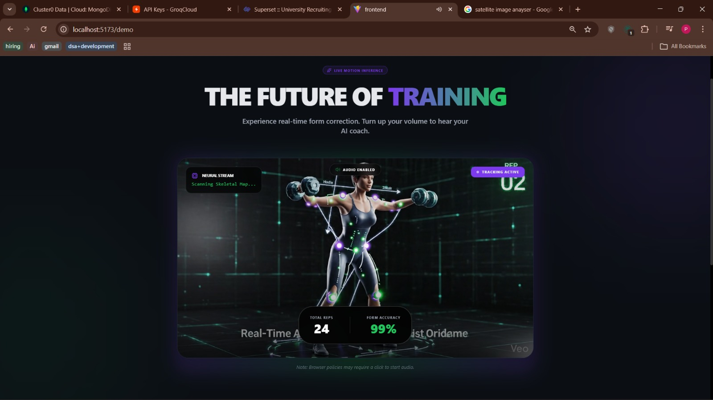

Shows the **future of training** with real-time motion tracking and AI-powered analysis.

---

## 🔐 Authentication System

### 📝 Signup Page

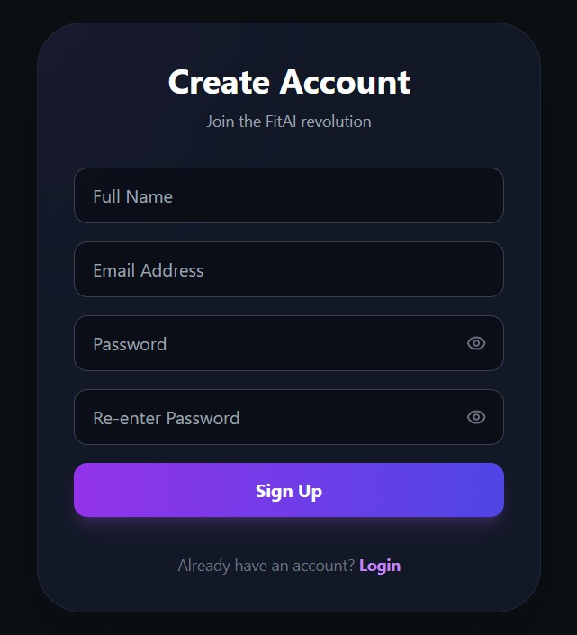

Users can create an account securely with validation.

### 🔑 Login Page

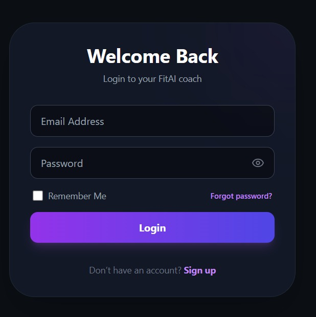

Secure login system with session handling and authentication.

---

## 📊 Personalized Dashboard

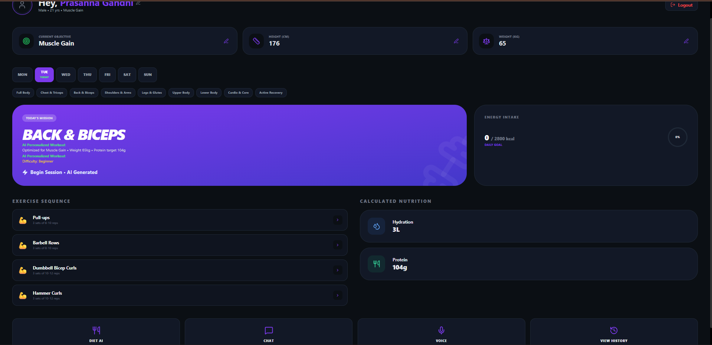

* Displays user profile (height, weight, goal)
* AI-generated daily workout
* Nutrition tracking summary
* Quick access to all features

---

## 🏋️ AI Workout + Pose Correction

### ▶️ Workout Start & Instructions

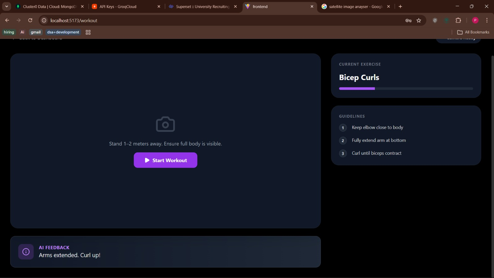

Provides instructions before starting exercise to ensure correct setup.

---

### 🧍 Real-Time Pose Estimation

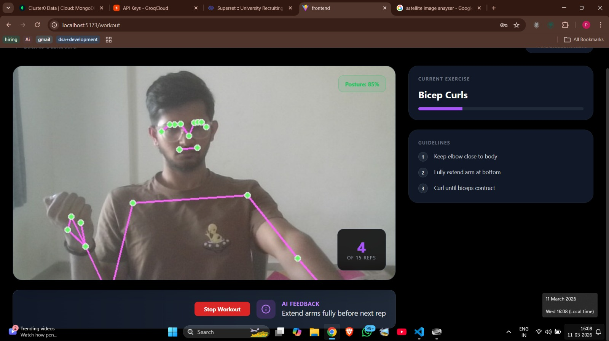

* Uses **MediaPipe (33 body landmarks)**
* Tracks movement in real-time
* Counts reps and evaluates posture

---

### ⚡ AI Feedback System

* Detects incorrect form
* Provides real-time correction suggestions
* Ensures safe and effective workouts

---

## 🥗 AI Diet Recommendation System

### 🌱 Vegetarian Plan

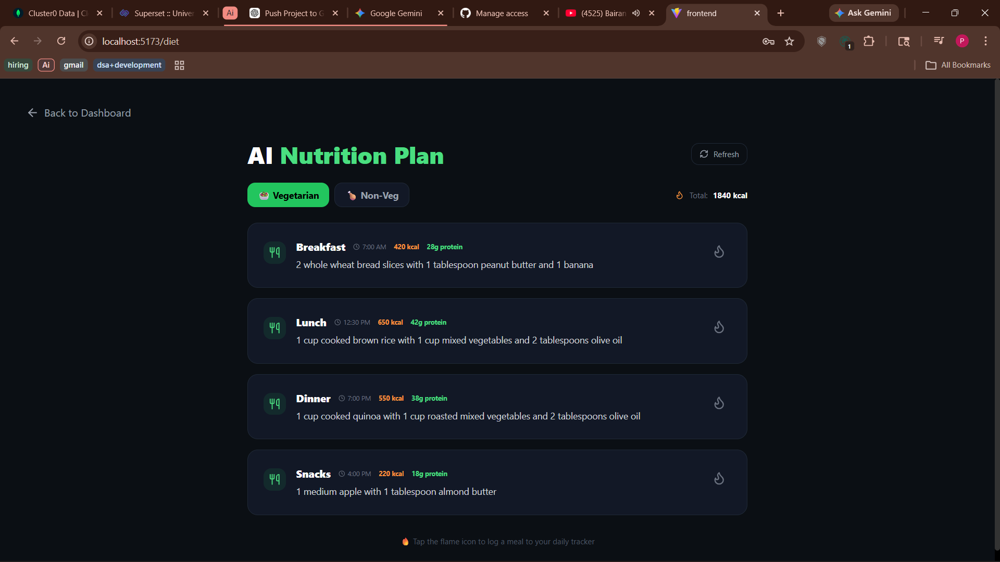

### 🍗 Non-Vegetarian Plan

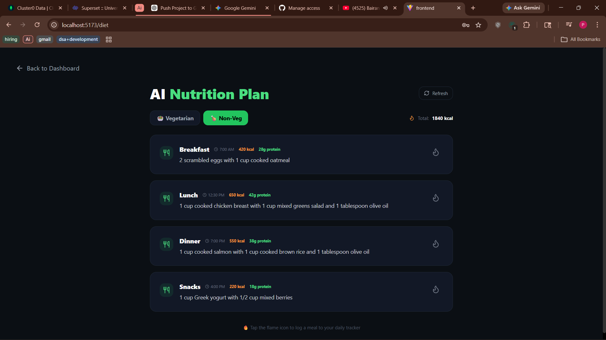

* Personalized diet based on goal
* Calorie tracking
* Macro distribution (protein, carbs, fats)

---

## 🤖 FitAI Chatbot

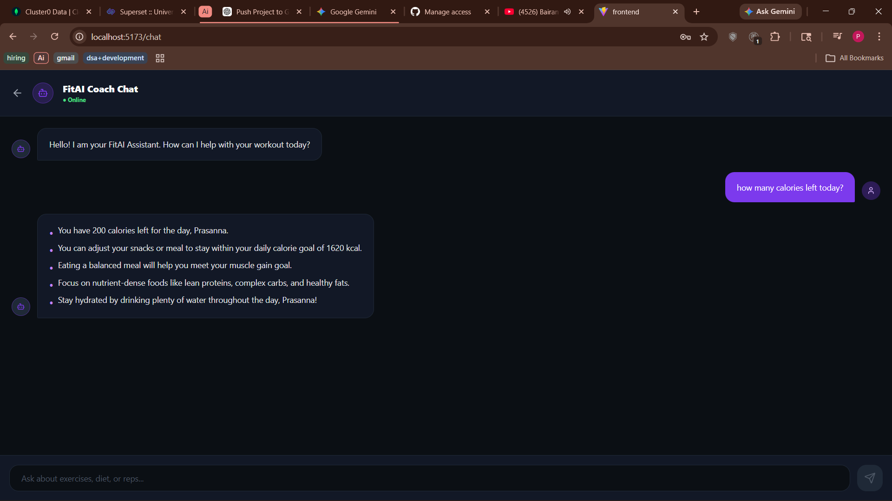

* Answers fitness-related queries
* Gives personalized suggestions
* Acts as your **daily AI coach**

---

## 🎤 Voice AI Assistant

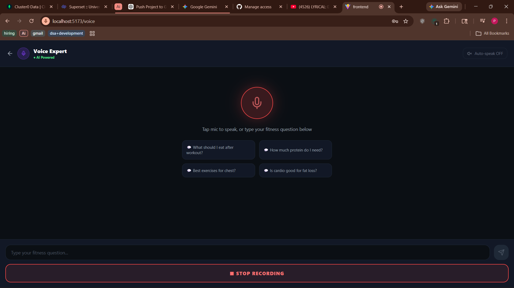

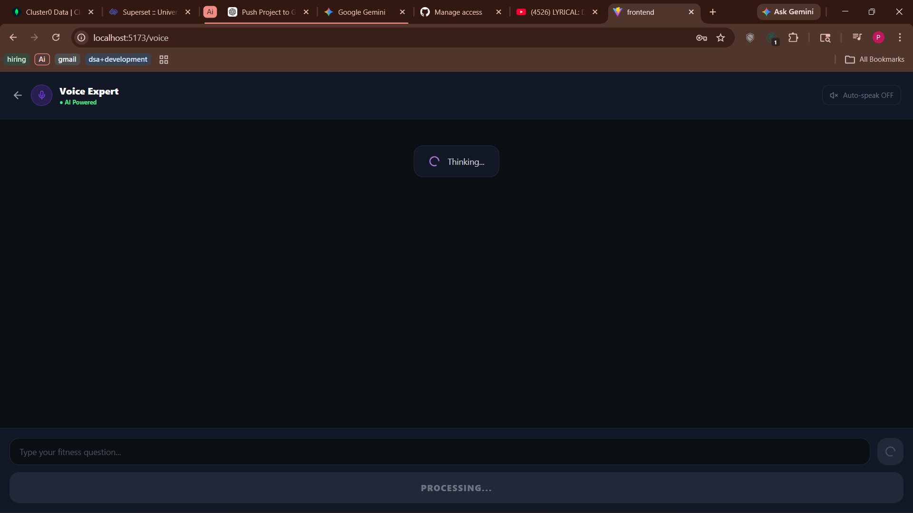

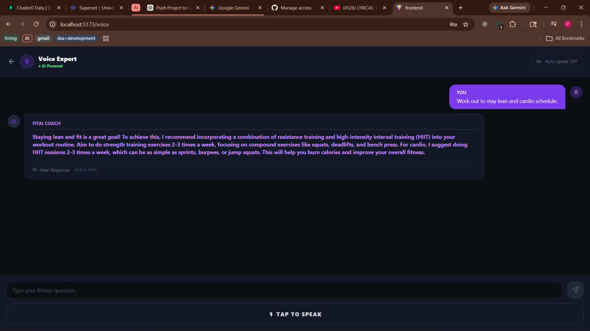

* Powered by **OpenAI Whisper (Speech-to-Text)**
* Ask fitness questions using voice
* Get intelligent AI responses instantly

---

## 🗄️ Database (MongoDB Atlas)

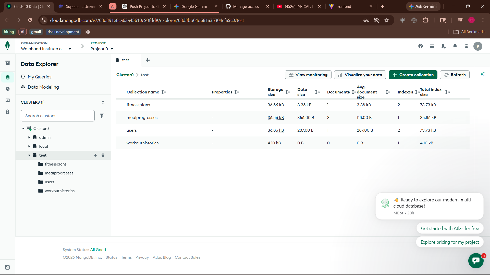

* Stores users, workout plans, and progress
* Scalable cloud-based database

---

## 🧠 Tech Stack

### 🌐 Frontend

* React (Vite)
* Tailwind CSS

### 🛠 Backend

* Node.js
* Express.js
* MongoDB Atlas

### 🤖 AI Services

* Python (Flask)
* OpenRouter API (`meta-llama/llama-3-8b-instruct`)
* OpenAI Whisper
* FFmpeg
* MediaPipe + OpenCV

---

## ⚙️ How It Works

1. User enters personal details + fitness goal
2. Backend sends data to AI services
3. AI generates:

   * Workout Plan
   * Diet Plan
4. User interacts via:

   * Chatbot
   * Voice assistant
   * Real-time workout tracking

---

## 🧑‍💻 Run Locally

### 1️⃣ Clone

```bash
git clone https://github.com/PrasannaGandhi/fitness-ai-project.git
cd fitness-ai-project
```

---

### 2️⃣ Backend

```bash
cd backend
npm install
```

Create `.env`:

```
PORT=5000
MONGO_URI=your_mongodb_url
JWT_SECRET=your_secret
OPENROUTER_API_KEY=your_key
```

Run:

```bash
npm start
```

---

### 3️⃣ Frontend

```bash
cd frontend
npm install
npm run dev
```

---

### 4️⃣ AI Services

#### STT Service

```bash
cd stt-ai-service
python -m venv venv
venv\Scripts\activate
pip install -r requirements.txt
python stt_app.py
```

#### Workout AI

```bash
cd workout-ai-service
python -m venv venv
venv\Scripts\activate
pip install -r requirements.txt
python app.py
```

---

## 📌 Important Notes

* `node_modules` and `venv` are not included → install dependencies manually
* MongoDB Atlas must be configured before running backend
* Add your own API keys in `.env`
* Run backend + AI services before frontend

---

## 🤝 Collaboration Guide

Pull latest:

```bash
git pull origin main
```

Push changes:

```bash
git add .
git commit -m "your message"
git push
```

---

## 🌟 Key Highlights

* 🔥 Real-time pose estimation with AI feedback
* 🎤 Voice-controlled fitness assistant
* 🧠 LLaMA 3 powered recommendations
* 🥗 Personalized diet + workout system
* 🤖 Intelligent chatbot guidance

---

## 👨‍💻 Contributors

* Prasanna Gandhi
* Sweety Bamb
* Himanshu Gadekar
* Sujal Dongare
