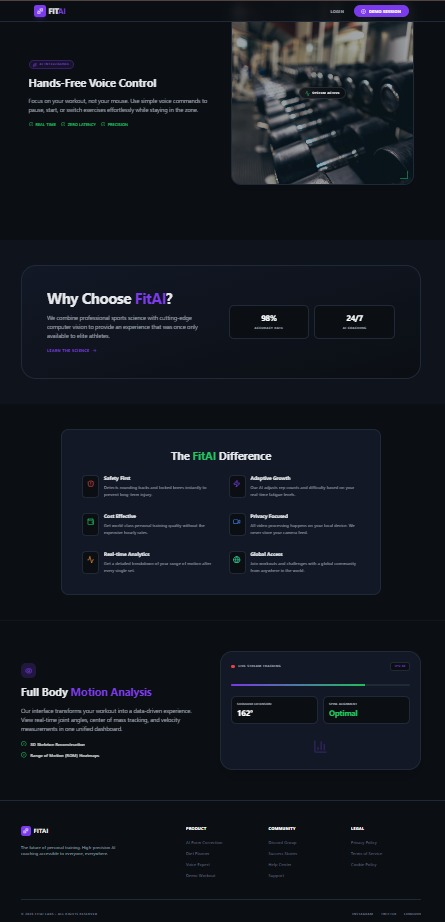

# 💪 FitAI – AI-Powered Fitness Assistant



FitAI is an intelligent fitness platform designed for beginners and fitness enthusiasts.
It generates **personalized workout plans and diet recommendations** based on user inputs like height, weight, age, gender, and fitness goals.

The system integrates **AI, voice interaction, and real-time pose estimation** to guide users without needing a personal trainer.

---

## 🚀 Features

* 🔐 User Authentication (Login / Signup)
* 🏋️ AI-Based Workout Plan Generation (Muscle Gain / Fat Loss / Maintenance)
* 🥗 Personalized Diet Plans (Veg & Non-Veg)
* 📊 Meal Logging with Calorie Tracking
* 📈 Workout History Tracking *(in progress)*
* 🤖 AI Chatbot (FitAI Coach for daily guidance)
* 🎤 Voice Assistant (Speech-to-Text using Whisper)
* 🧍 Real-Time Pose Estimation (MediaPipe + OpenCV)
* ⚡ AI Feedback for Exercise Form Correction

---

## 🧠 Tech Stack

### 🌐 Frontend

* React (Vite)
* Tailwind CSS

### 🛠 Backend

* Node.js
* Express.js
* MongoDB Atlas

### 🤖 AI Services

* Python (Flask)
* OpenRouter API (`meta-llama/llama-3-8b-instruct`)
* OpenAI Whisper (Speech-to-Text)
* FFmpeg (Audio Processing)
* MediaPipe + OpenCV (Pose Estimation)

---

## ⚙️ Project Structure

```
fitness-ai-project/
│
├── backend/
├── frontend/
├── stt-ai-service/
├── workout-ai-service/
```

---

## 🔄 How It Works

1. User enters personal details & selects a fitness goal
2. Backend processes request and sends it to AI services
3. AI generates:

   * Personalized workout plan
   * Customized diet plan
4. User can:

   * Log meals and track calories
   * Chat with AI fitness coach
   * Use voice assistant for queries
   * Perform exercises with real-time pose correction

---

## 🧑‍💻 Setup Guide (Run Locally)

### 1️⃣ Clone Repository

```bash
git clone https://github.com/PrasannaGandhi/fitness-ai-project.git
cd fitness-ai-project
```

---

## 🔹 Backend Setup

```bash
cd backend
npm install
```

Create a `.env` file inside `backend` folder:

```
PORT=5000
MONGO_URI=your_mongodb_atlas_url
JWT_SECRET=your_secret_key
OPENROUTER_API_KEY=your_api_key
```

Run backend:

```bash
npm start
```

---

## 🔹 Frontend Setup

```bash
cd frontend
npm install
npm run dev
```

---

## 🔹 Speech-to-Text AI Service

```bash
cd stt-ai-service
python -m venv venv
venv\Scripts\activate   # For Windows
pip install -r requirements.txt
python stt_app.py
```

---

## 🔹 Workout AI Service

```bash
cd workout-ai-service
python -m venv venv
venv\Scripts\activate   # For Windows
pip install -r requirements.txt
python app.py
```

---

## 📌 Important Notes

* `node_modules` and `venv` are not included → install dependencies manually
* MongoDB Atlas must be configured before running backend
* Add your own API keys in `.env` file
* Run backend and AI services before starting frontend

---

## 🤝 Collaboration Guide

### Pull latest changes:

```bash
git pull origin main
```

### Push your changes:

```bash
git add .
git commit -m "your message"
git push
```

---

## 🌟 Unique Highlights

* Real-time **pose estimation using MediaPipe (33 body landmarks)**
* AI-powered **form correction with feedback system**
* Voice-based interaction using **OpenAI Whisper**
* Fully AI-driven recommendations using **LLaMA 3 model via OpenRouter**
* Eliminates need for beginner gym trainer guidance

---

## 👨‍💻 Contributors

* Prasanna Gandhi
* Sweety Bamb
* Himanshu Gadekar
* Sujal Dongare
